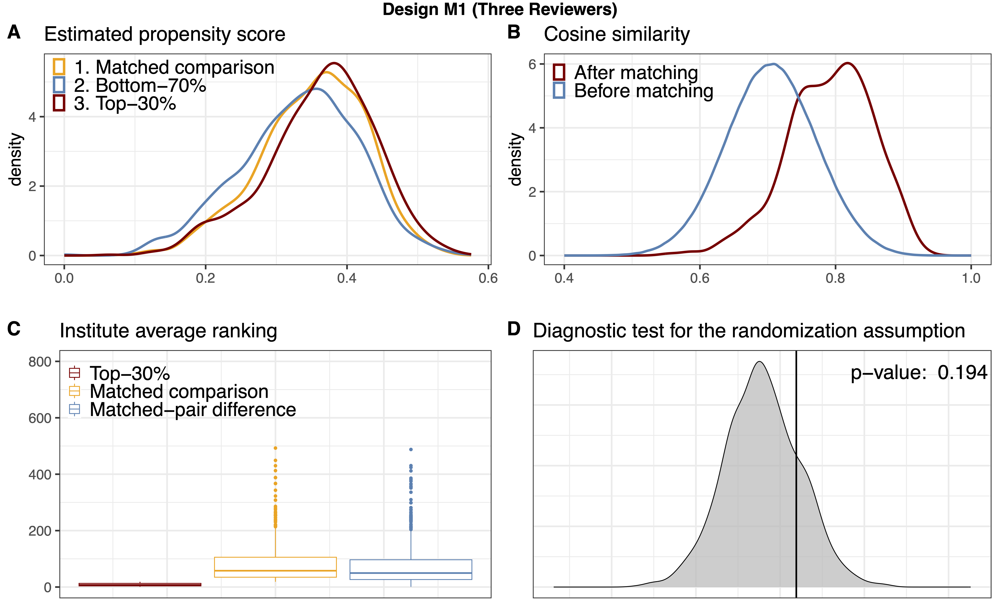

#  [Cognitive Computation Group](https://cogcomp.seas.upenn.edu/)

Double-blind peer review mechanism has become the skeleton of academic research across multiple disciplines, 
yet several studies have questioned the quality
of peer reviews and raised concerns on potential biases in the process.
Although studying the peer-review process is of interet to many,
features derived from textual data such as reviews or submissions
are underused.
This database tracks the latest International Conference
on Learning Representations (ICLR) submissions/reviews/author profiles
and conveniently packs metadata together with textual features for downstream analysis.

If you use this database in your work, please consider citing the following companion paper:

```bib
@misc{ZZDR22,
  title = {Investigating Fairness Disparities in Peer Review: A Language Model Enhanced Approach},
  author = {Zhang, Jiayao and Zhang, Hongming and Deng, Zhun and Roth, Dan},
  url = {https://arxiv.org/abs/2211.06398},
  publisher = {arXiv},
  year = {2022},
}

```


#### Table of Contents  

- [Getting Started](#getting-started)
  - [Getting the Database](#getting-the-database)
  - [Companion Paper and Example Notebooks](#companion-paper-and-example-notebooks)
- [Database Overview](#database-overview)
  - [Motivation](#motivation)
  - [Summary of Covariates](#summary-of-covariates)
  - [High-Level Textual Features](#high-level-textual-features)
- [Example Studies and Tasks](#example-studies-and-tasks)
  - [Association Between Author Metadata and Decision](#association-between-author-metadata-and-decision)
  - [Textual Feature and Fair Classifiers](#textual-feature-and-fair-classifiers)
  - [Review Generation](#review-generation)
- [Publications](#publications)


## Getting Started


### Getting the Database

Latest Snapshot:
- [ICLR 2017-2022](https://www.dropbox.com/s/iaps6dityc18kif/cs_conf_release.db?dl=1).

### Companion Paper and Example Notebooks

*A more refined and easy-to-follow notebook will be released soon.* For the time being, please refer to
the [companion paper](https://arxiv.org/abs/2211.06398) and
the notebooks [``paper_summary.ipynb``](paper_summary.ipynb) for instructions to reporduce figures and tables in the companion paper,
and the notebook [``analysis_glm.ipynb``](analysis_glm.ipynb) for the association studie via linear models.

## Database Overview


### Motivation


[ICLR](https://iclr.cc) is a leading CS conference whose data are openly available, thus providing
a convenient platform for studying potential biases in the peer-review process.
Indeed, the decision recommended by the area chair/program chair/meta reviewer
is not a clearcut when the average rating is "borderlined," for example,
between 5 to 7.  As another example, some regions consistently have
more accepted submissions, which may of be of interest to take a closer look at.

<p align="middle">
  
  
</p>
Looking deeper at the relative frequencies of acceptance
of borderline submissions across different groups, there is usually a discrepancy.
For example, the figures belows illustrate such discrepency (together with one sample standard deviation) across groups of

1. whether any author is from a top 1% institution; 
2. whether any author is a top 1% author (measured by number
of citation counts at the year of submission); and
3. whether any author if from the US.

<p align="middle">
  
  
  
</p>
Although at some average rating the discrepancies between two groups seem significant (say at level 0.05),
it is possilbe that it is due to selection bias, or other confounding factors.
Towards rigorous studies of the potential bias, it is beneficial to obtain more
covariates, especially those from the textual data themselves such as the submissions and the review texts.


### Summary of Covariates
Below is a brief summary of the ICLR data from 2017-2022;
we exclude all withdrawn submissions. For full table of
all covariates, see the [companion paper](https://arxiv.org/abs/2211.06398).

|                             | 2017 | 2018 | 2019 | 2020  | 2021  | 2022  |
|-----------------------------|------|------|------|-------|-------|-------|
| **Submissions**                 | 490  | 911  | 1419 | 2213  | 2595  | 2670  |
| Oral                        | 15   | 23   | 24   | 48    | 53    | 54    |
| Spotlight                   | 0    | 0    | 0    | 108   | 114   | 176   |
| Poster                      | 183  | 313  | 478  | 531   | 693   | 865   |
| Workshop* | 47   | 89   | 0    | 0     | 0     | 0     |
| Reject                      | 245  | 486  | 917  | 1526  | 1735  | 1574  |
| **Author**             | 1416 | 2703 | 4286 | 6807  | 7968  | 8654  |
| Female                      | 81   | 162  | 298  | 503   | 529   | 770   |
| Male                        | 769  | 1565 | 2527 | 3951  | 3992  | 5524  |
| Non-Binary                  | 1    | 2    | 2    | 2     | 3     | 6     |
| Unspecified                 | 565  | 974  | 1458 | 2351  | 2125  | 2354  |
| **Review**                      | 1489 | 2748 | 4332 | 6721  | 10026 | 10401 |
| Response                    | 2811 | 4404 | 9504 | 11350 | 18896 | 21756 |
| Comment                     | 750  | 1002 | 1354 | 816   | 376   | 133   |

*When we perform analysis, we view papers with decision "Invited to Workshop Track"
as a rejection.

### High-Level Textual Features

We start with three higher-level textual features:
1. Review sentiment from the [RoBERTa Sentiment Model](https://huggingface.co/cardiffnlp/twitter-roberta-base-sentiment);
2. Abstract embedding from the [Specter Model](https://huggingface.co/allenai/specter); and
3. Submission sentence-level fluency from the [Parrot Paraphrase Model](https://huggingface.co/prithivida/parrot_paraphraser_on_T5).

Below we show the review rating and sentiment histogram across submissions decisions;
*t*-SNE embedding of the Specter abstract embedding from a random sample of submissions with known arXiv primary category; and
a random arXiv sample of papers from different primary categories with their average sentence-level fluency. Note
that more features can be constructed based on them. For example, we can assign topic clusters (in additional to reported keywords)
using clustering algorithms on the Specter embedding.
<p align="middle">
  
  
  
</p>

## Example Studies and Tasks

Here we outline several example studies and tasks
the ICLR Database enables.

### Association Between Author Metadata and Decision

*More details can be found [in the paper](https://arxiv.org/abs/2211.15849).*

We consider using the database from 2017-2022 to perform a matched-cohort study to test
the Fisher's sharp null hypothesis of no effect:

$H_0: Y_i(\vec{a}) = Y_i(\vec{a}'), \quad \forall \vec{a}\ne\vec{a}', \vec{a},\vec{a}'\in\mathcal{A},$

where $\vec{a}, \vec{a}'$ are *author metadata,* a complete list of author names with their
corresponding academic or research institutions, and $\mathcal{A}$ is the set of all possible configurations of author metadata;
$Y_i(\cdot)$ is the potential-outcome of the $i$-th study unit (the submission, area chair pair) whose value
is either Accept and Reject. This sharp null states that for all units, the decision should remain the same
no matter what author metadata is perceived by the corresponding area chair.
To reduce the number of potential outcomes, we study specifically the prestige of author institutions, through
a variant of the *Stable Unit Treatment Value Assumption (SUTVA)* by assuming the dependency of $Y$ on $\vec{a}$
is only through the authors' institution. To this end, we consider a matched pair study on the following
sharp null

$H_0' : Y _ {ij}(\vec{a} _ {i1}) = Y_{ij}(\vec{a}' _ {i2}), \quad \forall i=1,\ldots, I, j = 1,2,$

by constructing $I$ matched pairs (indexed by the with subscript $j=1,2$). Note that
$H_0$ implies $H_0'$ and thus rejecting $H_0'$ would provide envidence against $H_0$.

There are several ways of defininig the ''prestige'' of institutions; we consider two study designs,
$M_1$ where the treated group consist of the submission-AC pairs whose average instution ranking of the authors
(ranked by past history of accepted papers) lies in the top-30%; and a strengthened design $M_2$ that only
consists units whose average ranking lies in top-20%.

After matching, we found the covariates are much more balanced, as shown in Tables 2-3 in the paper,
and also the following diagnostic plots of design $M_1$, here
in panel A we show the estimated propensity score top-30\% articles, bottom-70\% articles and matched comparison articles;
in panel B we observe that the distribution of between-article cosine similarity (from the SPECTER embedding) increases from before-matching (median = 0.71) to after-matching (median = 0.80); in panel C, we visulize boxplots of authors' average institution rankings and matched-pair differences in authors' average institution rankings; finally, in panel D we show the permutation distribution and the observed test statistic of the classification permutation test.

<p align="middle">
  
</p>

We can then perform a [two-sided, exact McNemar's test](https://journal.r-project.org/archive/2010/RJ-2010-008/index.html), whose details are given in the following contigency table. 
The odds-ratio suggests some weak evidence that borderline articles from top-30% institutions were
*less favored* by area chairs compared to their counterparts from the comparison group, defying the common wisdom of
''status bias.'' Nonetheless, as all retrospective, observational studies,
we cannot be certain that our analysis was immune from any unmeasured confounding bias,
and any interpretation of our results should be restricted to our designed matched sample
and should not be generalized to other contexts.

| Design $M_1$        |          | Comparison Articles                     |          |         |                        |
|---------------------|----------|-----------------------------------------|----------|---------|------------------------|
|                     |          | Accepted                                | Rejected | P-value | Odds Ratio (95%-CI) |
| Top-30% Articles | Accepted | 633                                     | 178      | 0.050   | 0.82 (0.67, 1.00)      |
|                     | Rejected | 218                                     | 556      |         |                        |
| Design $M_2$        |          | Comparison Articles |          |         |                        |
|                     |          | Accepted                                | Rejected |         |                        |
| Top-20% Articles | Accepted | 443                                     | 115      | 0.149   | 0.83 (0.64, 1.07)      |
|                     | Rejected | 139                                     | 354      |         |                        |


### Textual Feature and Fair Classifiers

One interesting question is that whether the inclusion
of (high-level) textual features would make classifiers
more fair (without using any fair algorithms.
We group features into several different groups,
including (i) ``base`` (submission features, including
high-level ones); (ii) ``author`` (on top of ``base``, adding all
author featres; (iii) ``rev`` (on top of ``base``, adding non high-level
review features (ratings, confidence, etc); (iv) ``revnlp`` (on top of ``rev``,
adding sentiment of reviews); (v) ``all`` (throw all features).

Below we plot the disparity of score cdfs across sensitive groups (we use US author
as an example here, more are included in the companion paper), the largest
disparity is usually referred to as the Demographic Parity (DP, see e.g., [Agarwal et al., 2019](https://arxiv.org/abs/1905.12843)
and [``fairlearn`` metrics guide](https://fairlearn.org/main/user_guide/assessment/)).

For this sensitive group, we note that the inclusion of review sentiments help
to reduce DP from 0.073 to 0.070. However, note that the inclusion does not always
help, as shown in the paper, it actually increase the DP for the groups based on top institutions.

<p align="middle">
  
  
  
  
  
</p>

### Review Generation

With the availability of [Longformer-Encoder-Decoder (LED)](https://github.com/allenai/longformer) models that
can take as inputs for a maximal of 16K tokens while most of submissions have below 12K tokens (see figure below),
we are interested in conditional generationg of reviews
on the tone of the review (positive (>7), negative (<5) or borderlined).

<p align="middle">
  
</p>

We fine-tune the LED model on the submission-review pairs based on the tone of the reviews
by minimizing the [ROGUE score](https://huggingface.co/spaces/evaluate-metric/rouge).
Tabulated below are two random samples from the test set, where ``(+)`` denotes the positive-toned generation
and ``(-)`` the negative generation.


| Model | Samples |
|----------------|---------------------------------------------------------------------------------------------------------------------------------------------------------------------------------------------------------------------------------------------------------------------------------------------------------------------------------------------------------------------------------------------------------------------------------------------------------------|
| **Submission**  | **``49h_IkpJtaE``** |
| Review Sample  | ```In this paper, the authors introduce a novel audio-visual dereverberation approach. They propose a Visually-Informed Dereverberation of Audio (VIDA) model for dereverberation. The authors also create synthetic/simulated datasets and real-world data for experimentation. Finally, they show the impact of the proposed VIDA model on several speech tasks including, recognition, enhancement, and speaker verification. The results are encouraging...``` |
| LED Output (+) | ```This paper proposes a new task of dereverberating speech from audio-visual observations. The goal is to learn to dereverberate speech from audio-visual observations. The task is to learn to dereverberate speech from audio-visual observations. The task is to learn to dereverberate speech from audio-visual observations. The visual environment surrounding a human speaker reveals important cues about the room geometry, materials, and speaker location, all of which influence the precise reverberation effects in the audio stream...``` |
| LED Output (-) | ```This paper proposes a method to learn to dereverberate speech from audio-visual observations. The idea is to learn to dereverberate speech from audio-visual observations. The paper is well written and easy to follow. However, I have several concerns about the paper:\n\n1. The proposed method is not novel. The proposed method is based on the UNet encoder-decoder architecture. The UNet encoder is based on the UNet encoder architecture. The UNet encoder is based on the UNet encoder architecture...``` |
| **Submission**  | **``49h_IkpJtaE``** |
| Review Sample  | ```The paper mainly investigates the effect of permutation in the class label assignment in the tasks for the MAML algorithm. First, the authors show that MAML requires a higher number of inner loop updates than what is commonly used. Then, they show that MAML is sensible to the permutation of the class labels in the tasks and experimented with diverse methods to alleviate this problem...``` |
| LED Output (+) | ```Summary:\n\nThe paper proposes a new model-agnostic meta-learning algorithm that is permutation-invariant in both the meta-training and meta-testing phases. The main idea is to meta-train only a single vector w, and use the learned initialization to initialize the linear classifiers. The inner loop optimization is done in the inner loop. The inner loop optimization is done in the inner loop...``` |
| LED Output (-) | ```This paper studies the problem of model-agnostic meta-learning (MAML) in few-shot learning. The main idea is to learn the initialization of an N-way classifier, which is the initialization of an N-way classifier, and then use the learned initialization to initialize the N linear classifiers. Experiments on MiniImageNet and TieredImageNet demonstrate the effectiveness of the proposed method.\n\nThe paper is well-written and easy to follow. However, I have some concerns about the novelty of the proposed method.\n\n1. The main idea of the paper is to learn the initialization of an N-way classifier, which is the initialization of an N-way classifier. However, the initialization of an N-way classifier is the initialization of an N-way classifier, which is the initialization of an N-way classifier...``` |

It is clear that there are several challenges. For example, reviews needs to contain summaries as well as *opinions*, which is hard to evaluate (even for humans, how to evaluate the novelty, say, of a paper?). In the generated samples above, we see that the summarization is usually done, whereas
there are signs of opinions (e.g., in the first sample, ``The proposed method is not novel``.) Furthermore, there are several consistency issues, for example, in the negative output of the first sample, a complement (``The proposed method is not novel.``) is followed by a concern (``However, I have several concerns about the paper.``). As such, there are lots of rooms for improvement on this task and the ICLR Database may be a good corpus for baselining review generation tasks.


## Publications

**2022**
- [Association Between Author Metadata and Acceptance: A Feature-Rich, Matched Abservational Study of a Corpus of ICLR Submissions Between 2017-2022](https://arxiv.org/abs/2211.15849)
- [Investigating Fairness Disparities in Peer Review: A Language Model Enhanced Approach](https://arxiv.org/abs/2211.06398)

