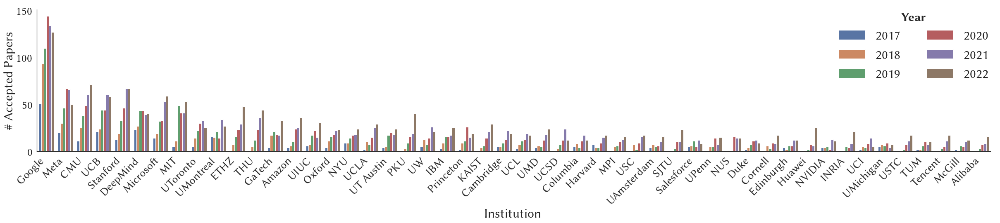
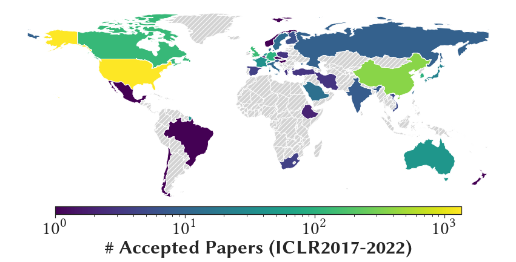
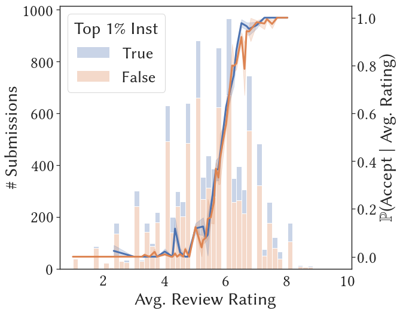
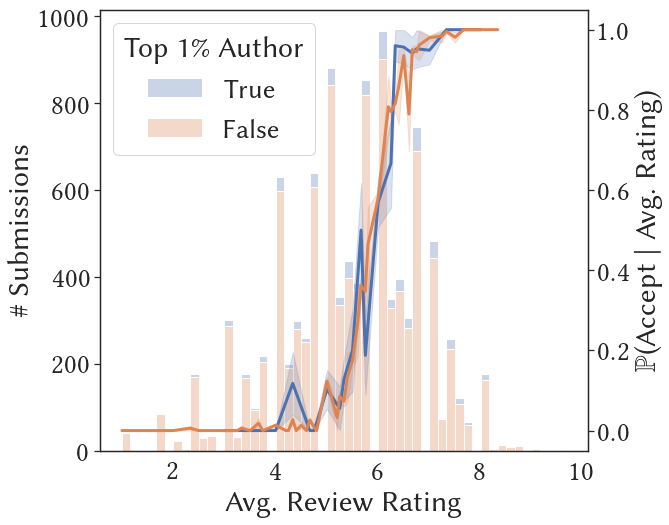
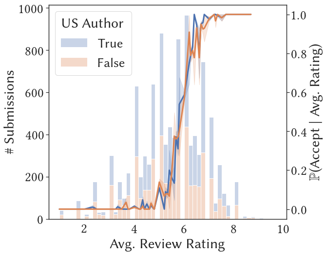
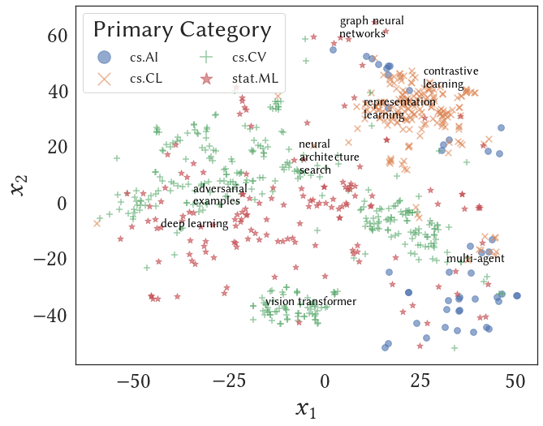
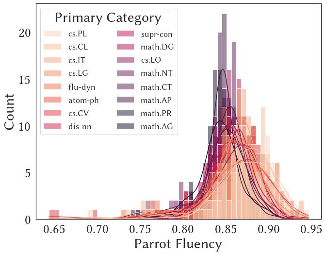

#  [Cognitive Computation Group](https://cogcomp.seas.upenn.edu/)

Double-blind peer review mechanism has become the skeleton of academic research across multiple disciplines, 
yet several studies have questioned the quality
of peer reviews and raised concerns on potential biases in the process.
Although studying the peer-review process is of interet to many,
features derived from textual data such as reviews or submissions
are underused.
This database tracks the latest International Conference
on Learning Representations (ICLR) submissions/reviews/author profiles
and conveniently packs metadata together with textual features for downstream analysis.

## Getting Started

### Getting the Database

Latest Snapshot:
- [ICLR 2017-2022](https://www.dropbox.com/s/iaps6dityc18kif/cs_conf_release.db?dl=1).

### Companion Paper and Example Notebooks

*A more refined and easy-to-follow notebook will be released soon.* For the time being, please refer to
the [companion paper](https://arxiv.org/abs/2211.06398) and
the notebooks [``paper_summary.ipynb``](paper_summary.ipynb) for instructions to reporduce figures and tables in the companion paper,
and the notebook [``analysis_glm.ipynb``](analysis_glm.ipynb) for the association studie via linear models.

## Database Overview

### Motivation

[ICLR](https://iclr.cc) is a leading CS conference whose data are openly available, thus providing
a convenient platform for studying potential biases in the peer-review process.
Indeed, the decision recommended by the area chair/program chair/meta reviewer
is not a clearcut when the average rating is "borderlined," for example,
between 5 to 7.  As another example, some regions consistently have
more accepted submissions, which may of be of interest to take a closer look at.

  
  

Looking deeper at the relative frequencies of acceptance
of borderline submissions across different groups, there is usually a discrepancy.
For example, the figures belows illustrate such discrepency (together with one sample standard deviation) across groups of

1. whether any author is from a top 1% institution; 
2. whether any author is a top 1% author (measured by number
of citation counts at the year of submission); and
3. whether any author if from the US.

  
  
  

Although at some average rating the discrepancies between two groups seem significant (say at level 0.05),
it is possilbe that it is due to selection biase, or other confounding factors.
Towards robust studies of the potential biase, it is beneficial to obtain more
covariates, especially those from the textual data themselves such as the submissions and the review texts.

### Summary of Covariates
Below is a brief summary of the ICLR data from 2017-2022;
we exclude all withdrawn submissions. For full table of
all covariates, see the [companion paper](https://arxiv.org/abs/2211.06398).

|                             | 2017 | 2018 | 2019 | 2020  | 2021  | 2022  |
|-----------------------------|------|------|------|-------|-------|-------|
| **Submissions**                 | 490  | 911  | 1419 | 2213  | 2595  | 2670  |
| Oral                        | 15   | 23   | 24   | 48    | 53    | 54    |
| Spotlight                   | 0    | 0    | 0    | 108   | 114   | 176   |
| Poster                      | 183  | 313  | 478  | 531   | 693   | 865   |
| Workshop* | 47   | 89   | 0    | 0     | 0     | 0     |
| Reject                      | 245  | 486  | 917  | 1526  | 1735  | 1574  |
| **Author**             | 1416 | 2703 | 4286 | 6807  | 7968  | 8654  |
| Female                      | 81   | 162  | 298  | 503   | 529   | 770   |
| Male                        | 769  | 1565 | 2527 | 3951  | 3992  | 5524  |
| Non-Binary                  | 1    | 2    | 2    | 2     | 3     | 6     |
| Unspecified                 | 565  | 974  | 1458 | 2351  | 2125  | 2354  |
| **Review**                      | 1489 | 2748 | 4332 | 6721  | 10026 | 10401 |
| Response                    | 2811 | 4404 | 9504 | 11350 | 18896 | 21756 |
| Comment                     | 750  | 1002 | 1354 | 816   | 376   | 133   |

*When we perform analysis, we view papers with decision "Invited to Workshop Track"
as a rejection.

### High-Level Textual Features

We start with three higher-level textual features:
1. Review sentiment from the [RoBERTa Sentiment Model](https://huggingface.co/cardiffnlp/twitter-roberta-base-sentiment);
2. Abstract embedding from the [Specter Model](https://huggingface.co/allenai/specter); and
3. Submission sentence-level fluency from the [Parrot Paraphrase Model](https://huggingface.co/prithivida/parrot_paraphraser_on_T5).

Below we show the review rating and sentiment histogram across submissions decisions;
*t*-SNE embedding of the Specter abstract embedding from a random sample of submissions with known arXiv primary category; and
a random arXiv sample of papers from different primary categories with their average sentence-level fluency. Note
that more features can be constructed based on them. For example, we can assign topic clusters (in additional to reported keywords)
using clustering algorithms on the Specter embedding.

  
  
  

## Publications

**2022**

- [Investigating Fairness Disparities in Peer Review: A Language Model Enhanced Approach](https://arxiv.org/abs/2211.06398)
